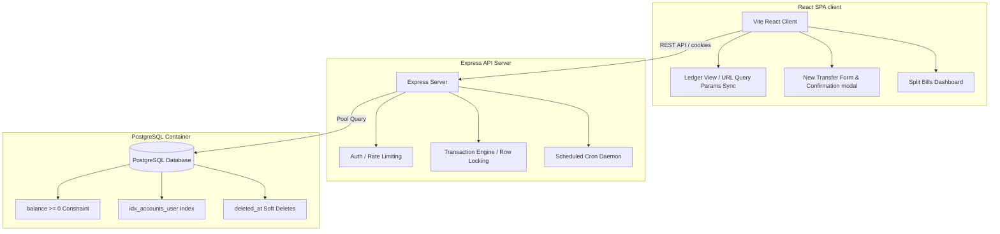

# 🌿 Verdant — "Money, cultivated."

<p align="center">
  
  
  
  
</p>

Verdant is a secure, state-of-the-art multi-page personal finance ledger and expense management application. Re-engineered with atomic database transactions, strict database check constraints, disk-based upload streaming, and automated sweep schedulers.

---

## 🎨 Design Aesthetics & Brand

* **Tagline**: *"Money, cultivated."*
* **Colors**: 
  - 🌿 Accent/Positive: `#2F4F3E` (Deep Forest Green)
  - 🧱 Alert/Negative: `#B5533C` (Muted Terracotta)
  - 🍦 Background: `#FAF7F2` (Warm Ivory)
  - 🐈 Charcoal: `#1C1B19` (Charcoal Black)
* **Aesthetics**: Premium Glassmorphic cards, custom typography, unified color variables, and fluid Micro-Animations using Framer Motion.
* **No Mock Data**: Every widget, chart, ledger row, and budget tracker is dynamically synced to live PostgreSQL backend endpoints.

---

## 🏗️ System Architecture & Workflow



---

## 📁 PostgreSQL Database Schema

### 1. Portfolios & Accounts
Supports multi-account sweeping and deposits. Balance cannot drop below zero.
```sql
CREATE TABLE accounts (
  id          TEXT PRIMARY KEY,
  name        TEXT NOT NULL,
  balance     BIGINT NOT NULL DEFAULT 0 CHECK (balance >= 0), -- Stored in Paise
  user_id     TEXT NOT NULL REFERENCES users(id) ON DELETE CASCADE,
  deleted_at  TIMESTAMPTZ
);
```

### 2. Transaction Audits
Strict idempotency checks and immutable logs.
```sql
CREATE TABLE transactions (
  id              TEXT PRIMARY KEY,
  idempotency_key TEXT UNIQUE,
  from_account    TEXT NOT NULL REFERENCES accounts(id) ON DELETE CASCADE,
  to_account      TEXT NOT NULL REFERENCES accounts(id) ON DELETE CASCADE,
  amount          BIGINT NOT NULL,
  status          TEXT NOT NULL CHECK(status IN ('pending', 'success', 'failed')),
  category        TEXT DEFAULT 'Uncategorized',
  note            TEXT,
  description     TEXT,
  merchant        TEXT,
  source          TEXT DEFAULT 'app',
  created_at      TIMESTAMPTZ NOT NULL DEFAULT now()
);
```

### 3. Automated sweeps
Maintains scheduled sweeping.
```sql
CREATE TABLE scheduled_transfers (
  id            TEXT PRIMARY KEY,
  user_id       TEXT NOT NULL REFERENCES users(id) ON DELETE CASCADE,
  from_account  TEXT NOT NULL REFERENCES accounts(id) ON DELETE CASCADE,
  to_account    TEXT NOT NULL REFERENCES accounts(id) ON DELETE CASCADE,
  amount        BIGINT NOT NULL,
  frequency     TEXT NOT NULL CHECK(frequency IN ('once', 'weekly', 'monthly')),
  next_run_date TIMESTAMPTZ NOT NULL,
  status        TEXT NOT NULL DEFAULT 'active' CHECK(status IN ('active', 'paused', 'cancelled', 'completed')),
  last_run_at   TIMESTAMPTZ,
  created_at    TIMESTAMPTZ NOT NULL DEFAULT now()
);
```

---

## ⚛️ High-End Fintech Logic

### 1. Atomic Transaction Execution
All money transfers checkout a connection from the pool and run inside a PostgreSQL transaction (`BEGIN`/`COMMIT`):
* **Row-Level Lock**: Acquires exclusive locks on sender and receiver rows (`SELECT FOR UPDATE`).
* **Check constraint**: Database engine guarantees `balance >= 0` check constraint. If balance is insufficient, transaction rolls back and records a `failed` row.
* **Idempotency**: Client-supplied `idempotency_key` guarantees duplicate actions are deduped.

### 2. Automated Scheduled Transfers (Sweeper)
* A background `node-cron` daemon ticks every minute to scan for due schedules (`next_run_date <= now()`).
* **Idempotency key generation**: Deterministic unique key formatting `scheduled_[schedule_id]_[scheduled_run_date]` ensures duplicate sweeping is physically blocked.
* **Date advancement**: Moves `next_run_date` forward (+7 days for weekly, +1 month for monthly, 'completed' status for once).

### 3. Outflow daily limit cap
* Sums successful outgoing transfers in the last 24 hours.
* Rejects any transaction that pushes the outflow total above **₹5,00,000/day**.

### 4. Soft Deletes
* Setting `deleted_at = now()` hides items (accounts, budgets, groups) from frontend query lists (`AND deleted_at IS NULL`), while keeping the full historical transaction records intact for financial audits.

---

## 🚀 Running Locally (Localhost Mode)

To run the application locally on your host machine:

### 1. Start the PostgreSQL Container
Ensure **Docker Desktop** is running, then start the database container:
```bash
docker-compose up db -d
```

### 2. Launch the Backend Server
Navigate to the `backend` folder, install dependencies, and start the hot-reload API server:
```bash
cd backend
npm install
npm run dev
```
*Loads environment configurations from `.env` and initializes PostgreSQL tables & seeds on boot.*

### 3. Launch the Frontend Application
Navigate to the `frontend` folder, install dependencies, and run the development bundle:
```bash
cd ../frontend
npm install
npm run dev
```
*Opens the web app at `http://localhost:5173/` proxying API requests to the backend.*
